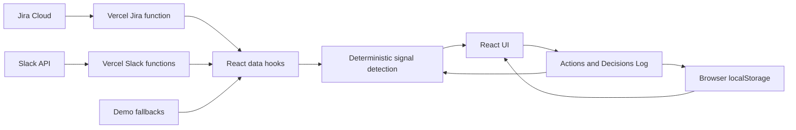

# Engineering Manager Dashboard

An AI-assisted decision-support dashboard for Engineering Managers. It turns fragmented engineering signals into explainable observations, concrete follow-up actions, and a lightweight record of leadership decisions.

**Live demo:** [em-dashboard-eight.vercel.app](https://em-dashboard-eight.vercel.app/)

## Why this exists

Engineering Managers rarely lack data. The harder problem is noticing meaningful patterns across delivery tools early enough to act on them.

This portfolio MVP explores a focused workflow:

```text
Jira + Slack + retrospective input
                 ↓
          Team Signals
                 ↓
     Engineering Manager review
                 ↓
       Actions + Decisions Log
```

The dashboard does not attempt to recreate Jira, summarize everything a manager does, or automate leadership decisions. It helps an EM identify signals, understand the evidence behind them, and decide what deserves follow-up.

## What the dashboard supports

### Delivery Radar

A flow-oriented delivery overview designed for Scrum, Scrumban, and Kanban teams without relying on story points.

- A browser-saved Current Delivery Goal with explicitly linked Jira issues
- Goal progress based on linked issue completion
- Blocked work and how long it has been blocked
- Stale work with no recent activity
- High work in progress by contributor
- Cross-team dependencies
- Median cycle time for the last 14 days compared with the previous 14 days
- Links to related Team Signals

The goal configuration is stored in the current browser. Issue details and statuses come from Jira when the live integration is available.

### Team Signals

Explainable patterns derived from delivery, collaboration, quality, and improvement data.

Each signal includes:

- why it matters
- observed evidence and links to original sources where available
- confidence and severity
- live, demo, or user-entered source labelling
- a suggested follow-up
- acknowledgement, monitoring, and resolution states
- a deliberate Create action handoff

Current examples include blocked delivery work, stale tickets, concentrated work in progress, recurring release friction, unanswered team questions, and retrospective actions that have remained open without progress.

### Actions

A frontend-only action tracker where the Engineering Manager remains the decision-maker.

- Suggested actions created from Team Signals
- Manually entered follow-ups
- Retrospective actions with retro date and theme
- Owner, due date, priority, context, and optional linked Jira issue
- Accept, complete, dismiss, and archive flows
- Decisions Log for accepted, completed, and dismissed follow-ups

An active retrospective action can become a Team Signal after 14 days, connecting improvement commitments back into the dashboard's core decision loop.

## Data sources and trust model

| Data | Mode | Purpose |
| --- | --- | --- |
| Jira issues, statuses, changelogs, and dependencies | Live with labelled demo fallback | Delivery Radar and Jira-based Team Signals |
| Slack channel messages and reply counts | Live with labelled demo fallback | Collaboration and recurring-pattern signals |
| Delivery goal, linked issues, actions, decisions, and signal statuses | User-entered, stored in `localStorage` | Frontend-only interaction and persistence |
| Seeded team context and actions | Demo | A reliable interview scenario and fallback experience |
| GitHub review metrics | Demo only | An intentionally limited example; a live integration is deferred until collaborative PR data exists |

Jira and Slack refresh when the app loads, on manual request, and automatically every five minutes while the page is visible. If an integration fails, the dashboard remains usable with clearly labelled demo fallback data.

The current signal detection is deterministic and explainable rather than a black-box external AI call. This keeps the evidence traceable and makes the product behaviour reliable for the MVP. A future AI layer could enrich interpretation without changing the source and evidence contracts.

## Architecture



The frontend is a React and TypeScript application built with Vite and Tailwind CSS. Vercel server functions keep Jira and Slack credentials off the client, normalize external data, and return small frontend-facing contracts.

## Jira Cloud integration

The Jira function reads active project work plus issues completed in the last 28 days. Changelog data is used to derive blocked duration, start dates, completion dates, and rolling cycle-time comparisons. Jira remains read-only; the dashboard never updates an issue.

Required server-side environment variables:

```env
JIRA_BASE_URL=https://your-site.atlassian.net
JIRA_PROJECT_KEY=TFP
JIRA_USER_EMAIL=you@example.com
JIRA_API_TOKEN=
```

`JIRA_JQL` can optionally override the default query. See [`.env.example`](.env.example) for the expected shape.

## Slack integration

Slack credentials are read only by Vercel server functions. Never expose the bot token through a `VITE_` variable.

Required bot token scopes:

- `channels:read`
- `channels:history`
- `users:read`

The configured channels are:

- `#platform-help`
- `#platform-team`
- `#platform-release`
- `#incidents`

The integration reads the latest 14 days, up to 100 root messages per channel. It uses Slack display names, reply counts, and server-resolved permalinks to original evidence. Thread contents are intentionally outside the MVP.

Available endpoints:

- `/api/slack/health` verifies authentication
- `/api/slack/channels` verifies configured channel access
- `/api/slack/messages` retrieves and normalizes recent messages
- `/api/slack/permalink` validates evidence references and redirects to the original Slack message

After changing scopes, reinstall the Slack app, update `SLACK_BOT_TOKEN`, and redeploy. The bot must be invited to each configured channel that requires membership.

## Local development

Requirements: a current Node.js release and npm.

```bash
npm install
npm run dev
```

The regular Vite development server displays the frontend and uses demo fallbacks when the Vercel API functions are unavailable. To exercise live server functions locally, configure the variables from [`.env.example`](.env.example) and run the project through the Vercel development environment.

Before deployment:

```bash
npm test
npm run lint
npm run build
```

Never commit a populated environment file or expose Jira and Slack secrets through client-side `VITE_` variables.

## Interview demo flow

A concise demonstration takes approximately five minutes:

1. Open **Delivery Radar** and explain that the goal is intentionally separate from Jira while linked issue status is live.
2. Show blocked work, stale tickets, work-in-progress concentration, and the rolling cycle-time comparison.
3. Open **Team Signals**, choose one signal, and inspect its confidence, evidence, source mode, and suggested follow-up.
4. Create an action from the signal to demonstrate that the system suggests but does not decide.
5. In **Actions**, accept the suggestion by assigning an owner, due date, and priority.
6. Add a user-entered retrospective action and explain how an unresolved action can later reappear as a Team Signal.
7. Open **Decisions Log** to show the lightweight audit trail.

Use **Reset interview demo** in the footer to clear browser-saved goals, actions, decisions, and signal statuses before a new demonstration. Live integration credentials and external Jira or Slack data are not changed.

## Deliberate MVP boundaries

- No authentication or multi-user state
- No database or backend persistence beyond Vercel integration functions
- No writes to Jira or Slack
- No Slack thread-body ingestion
- No live GitHub integration while the example repository lacks meaningful collaborative PR and review activity
- No employee ranking, commit counting, or lines-of-code productivity metrics
- No automatic assignment, prioritization, or completion of actions by AI

These boundaries keep the product centred on explainable decision support rather than tool duplication or developer surveillance.

## Possible next steps

Future work should be driven by real usage rather than integration count. Plausible extensions include configurable refresh windows, secure multi-user persistence, a real AI interpretation layer over the existing evidence model, Slack thread analysis, and Jira webhooks when true event-driven updates become valuable.

## Project context

Created with intention by [Emma Smedslund](https://www.linkedin.com/in/emmasmedslund/) in collaboration with Claude Code, 2026.
